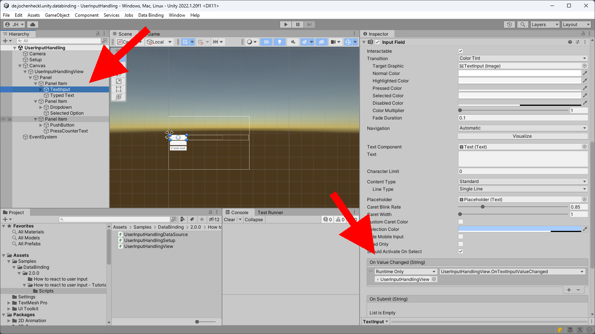
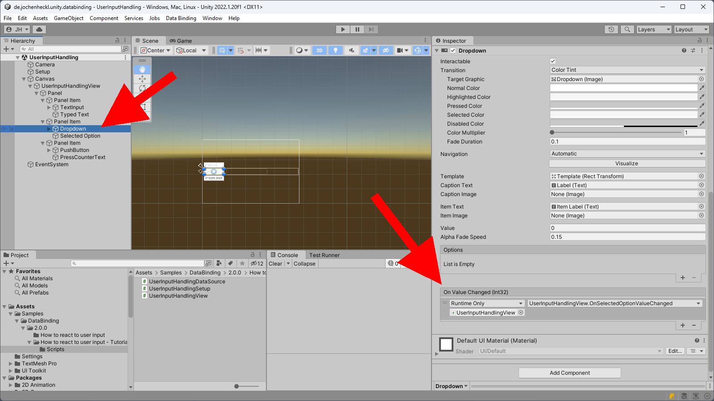
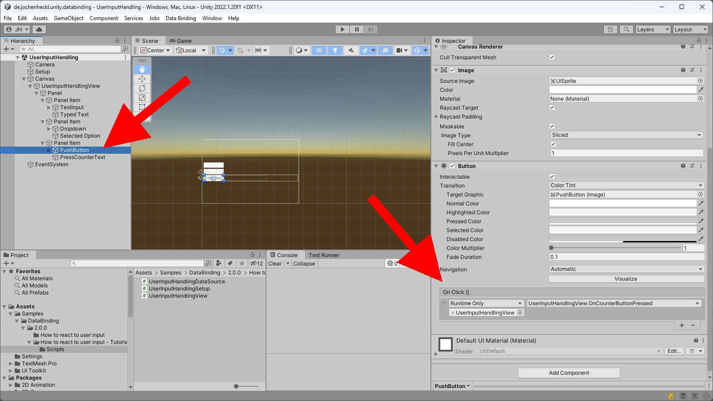
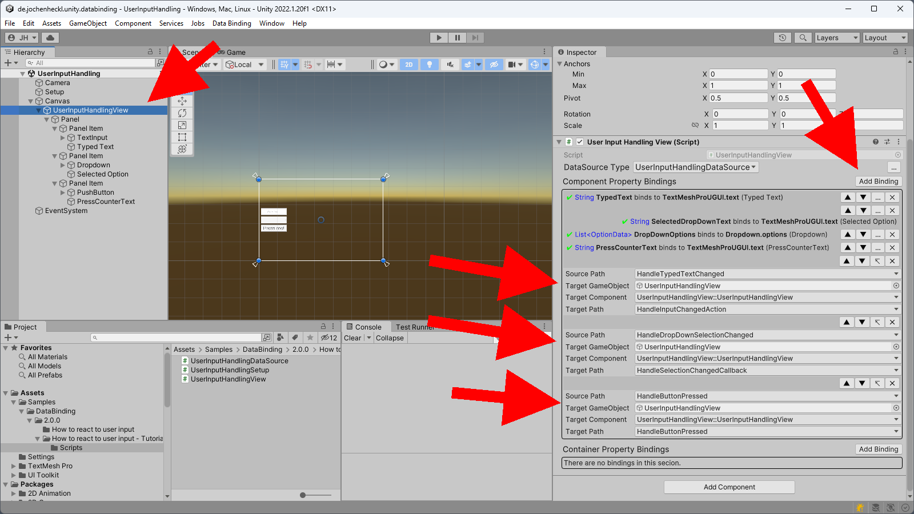

# How to react to user input

This is a short step by step tutorial that will teach you how to react to user input using data bindings.

We assume you completed the ["Getting Started" tutorial](../README.md)  and have a basic understanding of what data bindings are.

## Open the tutorial project

- Open up Unity.
- Import the DataBinding package if you have not done this already. You can follow the instructions in the ["Getting Started" tutorial](../README.md) to do so.
- Open the PackageManager Window ( Menu: Window ⟶ Package Manager ) and select the DataBinding package.
- From the samples on the right select and import the **"How to react to user input - Tutorial"** one.
- Back in unity open the "UserInputHandling" scene.
- Running the sample renders a simple User Interface with a Textfield, a Dropdown, a PushButton and some feedback text about performed interactions.
  
  

  The Text does not react for now, but we will fill in the blanks and make the text reflect the interactions we performed in this tutorial...

## Binding handlers to the view

- In order to bind anything we will have to define properties within the ViewModel to refer to. To do this lets open the file **UserInputHandlingDataSource.cs** and add properties that can be used to store interaction handlers.

  <details>
  <summary>Show code</summary>

  ```csharp
    using System;
    using System.Collections.Generic;
    using static UnityEngine.UI.Dropdown;
    
    namespace de.JochenHeckl.Unity.DataBinding.Example
    {
        public class UserInputHandlingDataSource: DataSourceBase<UserInputHandlingDataSource>
        {
            public string TypedText { get; set; }
            public string SelectedDropDownText { get; set; }
            public string PressCounterText { get; set; }

            public List<OptionData> DropDownOptions { get; set; }

            // Tutorial Step: Add properties to store the interaction handles.
            public Action<int> HandleDropDownSelectionChanged { get; set; }
            public Action HandleButtonPressed { get; set; }
            public Action<string> HandleTypedTextChanged { get; set; }
        }
    }

  ```
  </details>

- When we take a look at **UserInputHandlingSetup.cs**, we find some handlers that reflect user interactions and map feedback to the respective text samples already defined.

  We want to bind these handlers to the respective controls of the user interface. So we store them in the view model.

  <details>
  <summary>Show code</summary>

  ```csharp
    using System;
    using System.Collections.Generic;
    using System.Linq;

    using UnityEngine;
    using UnityEngine.UI;

    using static System.Net.Mime.MediaTypeNames;

    namespace de.JochenHeckl.Unity.DataBinding.Example
    {
        public class UserInputHandlingSetup : MonoBehaviour
        {
            public View view;

            private UserInputHandlingDataSource viewModel;
            private int pressCounter = 0;

            public void Start()
            {
                var dropdownOptions = new List<Dropdown.OptionData>()
                {
                    new Dropdown.OptionData() { text = "Option 01" },
                    new Dropdown.OptionData() { text = "Option 02" },
                };

                viewModel = new UserInputHandlingDataSource();

                viewModel.TypedText = MakeDisplayText(null);
                viewModel.SelectedDropDownText = MakeOptionText(dropdownOptions[0]);
                viewModel.PressCounterText = MakePressCounterText(pressCounter);

                viewModel.DropDownOptions = dropdownOptions;
                
                // Tutorial Step: Store the handlers in the ViewModel for our user interface.
                viewModel.HandleTypedTextChanged = HandleTypedTextChanged;
                viewModel.HandleDropDownSelectionChanged = HandleDropDownSelectionChanged;
                viewModel.HandleButtonPressed = HandleButtonPressed;

                view.DataSource = viewModel;
            }

            private void HandleDropDownSelectionChanged(int selectedOptionIndex)
            {
                viewModel.NotifyChanges(
                    (x) =>
                        x.SelectedDropDownText = MakeOptionText(x.DropDownOptions[selectedOptionIndex])
                );
                ;
            }

            private void HandleTypedTextChanged(string newText)
            {
                viewModel.NotifyChanges((x) => x.TypedText = MakeDisplayText(newText));
            }

            private void HandleButtonPressed()
            {
                pressCounter++;
                viewModel.NotifyChanges((x) => x.PressCounterText = MakePressCounterText(pressCounter));
            }

            private string MakeDisplayText(string newText)
            {
                if (string.IsNullOrEmpty(newText))
                {
                    return "No text was typed.";
                }
                else
                {
                    return $"You typed the text: {newText}.";
                }
            }

            private string MakeOptionText(Dropdown.OptionData optionData)
            {
                return $"Selected Option: {optionData.text}";
            }

            private string MakePressCounterText(int pressCounter)
            {
                return $"You pressed a button {pressCounter} times";
            }
        }
    }

  ```
  </details>

- To hook the ViewModel properties up to the actual controls of the view we have to take a little detour because Unity UI controls do not expose properties we could map to.

  So, we open the view **UserInputHandlingView.cs**, and define some properties we can map to.
  
  We also define methods in he view that fast forward to the mappable action properties.

  <details>
    <summary>Show code</summary>

  ```csharp
    using System;

    namespace de.JochenHeckl.Unity.DataBinding.Example
    {
        public class UserInputHandlingView : View
        {
            // Tutorial Step: Define action properties we can map to.
            public Action<string> HandleInputChangedAction { get; set; }
            public Action<int> HandleSelectionChangedCallback { get; set; }
            public Action HandleButtonPressed { get; set; }

            // Tutorial Step: Define "Unity control mappable methods" that forward to "data binding mappable properties".
            public void OnTextInputValueChanged(string newValue) =>
                HandleInputChangedAction?.Invoke(newValue);

            public void OnSelectedOptionValueChanged(int newValue) =>
                HandleSelectionChangedCallback?.Invoke(newValue);

            public void OnCounterButtonPressed() => HandleButtonPressed?.Invoke();
        }
    }
  ```
  </details>

- Now we install the Methods as Handler for
  - TextField::OnValueChanged

    

  - Dropdown::OnValueChanged

    

  - PushButton::OnClick

    

- Finally we just go and bind the properties as we used to.

  


- When we click play now, the text samples reflect user input.

  

